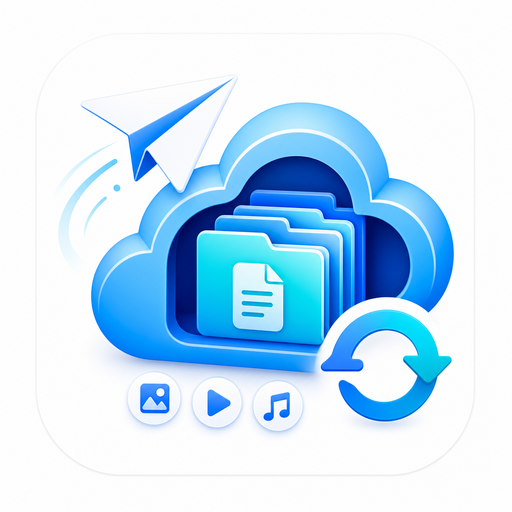

<p align="center">
  <strong>简体中文</strong> | <a href="README_EN.md"><strong>English</strong></a>
</p>

<div align="center">
  

  <h1>TG Vault</h1>

  <p>
    <strong>Telegram 文件转存与归档</strong>
  </p>
  <p>
    面向个人与小团队的 Telegram 转存、媒体归档和多存储源文件管理系统。
  </p>

  <p>
    <a href="#-快速部署-docker-compose"><strong>快速部署</strong></a>
    ·
    <a href="#-功能概览"><strong>功能概览</strong></a>
    ·
    <a href="#-telegram-bot-命令"><strong>Bot 命令</strong></a>
    ·
    <a href="deploy/DEPLOY.md"><strong>部署指南</strong></a>
  </p>

  <p>
    <a href="https://github.com/hicocos/tg-vault/releases"></a>
    <a href="https://github.com/hicocos/tg-vault/blob/main/LICENSE"></a>
    <a href="https://github.com/hicocos/tg-vault/stargazers"></a>
    <a href="https://github.com/hicocos/tg-vault/network/members"></a>
  </p>
  <p>
    
    
    
    
  </p>
</div>

从 Telegram 私聊、频道或群组保存文件，在 Web 中浏览和管理。支持本地磁盘、OneDrive、Google Drive、OSS、S3 和 WebDAV。

---

## ✨ 功能概览

- **文件管理**：上传、预览、整理文件夹，在浏览器中管理归档内容。
- **Telegram 转存**：发送文件给 Bot，或从频道、群组批量保存媒体。
- **订阅同步**：订阅频道，自动保存后续更新。
- **多种存储**：支持本地磁盘、OneDrive、Google Drive、OSS、S3 和 WebDAV。
- **自动归档**：按来源、频道和文件类型整理文件。
- **访问保护**：管理员登录、Bot 用户权限和双重验证。

---

## 🚀 快速部署 (Docker Compose)

准备一台 Linux 服务器，以及用于网页和 API 的两个域名。

### 1. 下载项目

```bash
git clone https://github.com/hicocos/tg-vault.git
cd tg-vault
```

### 2. 运行一键脚本

```bash
./deploy/install.sh
```

按提示检查环境，填写 Web 和 API 地址，确认后开始安装。

### 3. 开始使用

按照[部署指南](deploy/DEPLOY.md#4-配置宿主机反向代理)为两个域名配置 HTTPS，然后打开网页创建管理员账号。

进入 **设置 → Telegram** 连接 Bot；需要频道转存或订阅同步时，再登录 Telegram 账号。其他存储服务可在 **设置 → 存储** 中添加。

[查看完整部署指南](deploy/DEPLOY.md) · [Telegram 配置说明](docs/configuration.md#-telegram-配置与能力)

---

## 🧭 Telegram Bot 命令

连接 Bot 后，发送 `/start` 开始使用，发送 `/help` 查看帮助。

| 命令 | 用途 |
| --- | --- |
| `/list` | 查看最近文件 |
| `/tasks` | 查看和管理任务 |
| `/storage` | 查看存储状态 |
| `/path_rules` | 设置保存位置 |
| `/tg_download` | 打开频道、群组下载向导 |
| `/tg_sub` | 添加频道订阅 |
| `/tg_subs` | 查看订阅 |

频道下载与订阅需要登录有访问权限的 Telegram 账号。

<details>
<summary>更多命令</summary>

- **文件管理**：`/delete <至少 8 位 ID 前缀>` 删除文件；`/setup_2fa` 设置双重验证。
- **任务控制**：`/task_pause [任务ID]`、`/task_resume [任务ID]`、`/task_cancel <任务ID或all>`、`/stop_tasks`。
- **保存目录**：`/p <目录>` 仅用于下一次下载；`/ps <目录>` 用于当前会话；`/pc` 清除自定义目录。
- **批量下载**：`/tg_download date <频道> <开始日期> <结束日期>`、`/tg_download tag <频道> <#标签>`。
- **订阅与重试**：`/tg_unsub <频道或订阅ID前缀>` 取消订阅；`/tg_retry [数量] [任务ID]` 重试失败任务。
- **下载设置**：`/download_workers`、`/file_concurrency`、`/duplicate_mode`、`/cleanup_settings`。

</details>

---

## 🔄 维护与更新

进入自己的 TG Vault 项目目录，运行一键升级脚本：

```bash
./deploy/install.sh
```

---

## 📚 文档

- [部署指南](deploy/DEPLOY.md)：安装、域名配置、环境兼容与故障排查。
- [配置与使用](docs/configuration.md)：Telegram 接入、访问权限与高级配置。
- [本地存储位置](docs/local-storage.md)：选择和查看文件保存目录。
- [版本更新](https://github.com/hicocos/tg-vault/releases)：查看新增功能与修复。

---

## 📂 项目结构

```text
TG Vault/
├── frontend/           # React 网页前端
├── backend/            # Node.js API 与 Telegram 服务
├── init.sql            # 数据库初始化脚本
├── docker-compose.yml  # Docker Compose 部署配置
├── .env.example        # 环境变量模板
└── LICENSE             # MIT License
```

---

## 📄 开源协议

基于 [MIT License](LICENSE) 开源。

作者：[hicocos](https://github.com/hicocos) · 仓库：[hicocos/tg-vault](https://github.com/hicocos/tg-vault)

---

## 📊 项目数据


<div align="center">
  <a href="https://www.star-history.com/#hicocos/tg-vault&amp;type=date&amp;legend=top-left">
    <picture>
      <source media="(prefers-color-scheme: dark)" srcset="https://api.star-history.com/svg?repos=hicocos/tg-vault&amp;type=date&amp;legend=top-left&amp;theme=dark" />
      
    </picture>
  </a>
</div>
